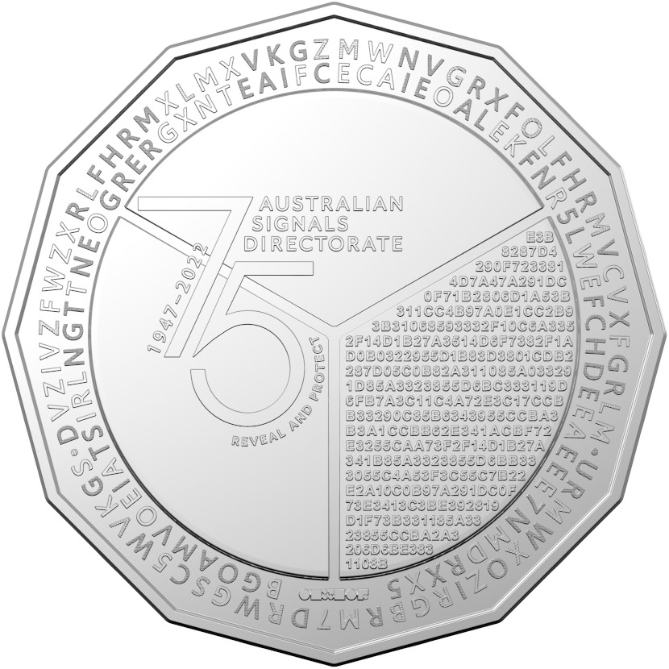

# Cracking the coin code with Python



My work asked me to have a look at the [Australian Signals Directorate (ASD) 75th anniversary coin challenge](https://www.abc.net.au/news/2022-09-01/act-spy-agency-releases-coin-with-secret-code/101391964).
The agency is using the coin as a novel recruitment/marketing campaign.
If you're interested, the ASD website has more details, [including high-resolution images of the coin](https://www.asd.gov.au/75th-anniversary/events/commemorative-coin-challenge).

I'm a complete cryptography n00b and always will be.
I barely knew the difference between binary and hexadecimal numbers.
But my manager told me: "Surely we should know what this coin says before we bring everyone's attention to it?"

So I had a stab at it &mdash; and had heaps of fun stumbling through the puzzles.
And given that some people have published how-to guides online, I figure it's worth writing down how I approached this with Python.
(Most people seemed to use C++, because they're real programmers, or R, because they're fashionable.)

If you want to decipher the ASD's encrypted messages yourself, stop reading and throw yourself into it!
But if you're time poor, learn from me.
I wasted hours on the wrong ideas ([it looks like a Caesar cipher](https://en.wikipedia.org/wiki/Caesar_cipher) but it's not) and even more hours on a typo in my code.

In fact, let's start by avoiding typos.
These are error-free strings of the characters we can see on the tails side.
I wasted hours on those, too, thinking they marked a disguised code wheel &mdash; [some kind of a substitution cipher] &mdash; but none of the string lengths are equal.

```python
# code on the tails side (weights are 1=light, 2=striped, 3=dark)

outer_ring_characters = "DVZIVZFWZXRLFHRMXLMXVKGZMWNVGRXFOLFHRMVCVXFGRLM.URMWXOZIRGBRM7DRWGSC5WVKGS."
outer_ring_weights = "311112111132333312113332213323332133323123133213332323132123113231231321312"

inner_ring_characters = "BGOAMVOEIATSIRLNGTTNEOGRERGXNTEAIFCECAIEOALEKFNR5LWEFCHDEEAEEE7NMDRXX5"
inner_ring_weights = "1333331131331113331331333311113331311133133113313311333331133133113313"

hexcode = """
    E3B
    8287D4
    290F723381
    4D7A47A291DC
    0F71B2806D1A53B
    311CC4B97A0E1CC2B9
    3B31068593332F10C6A335
    2F14D1B27A3514D6F7382F1A
    D0B0322955D1B83D3801CDB2
    287D05C0B82A311085A03329
    1D85A3323855D6BC333119D
    6FB7A3C11C4A72E3C17CCB
    B33290C85B6343955CCBA3
    B3A1CCBB62E341ACBF72
    E3255CAA73F2F14D1B27A
    341B85A3323855D6BB33
    3055C4A53F3C55C7B22
    E2A10C0B97A291DC0F
    73E3413C3BE392819
    D1F73B331185A33
    23855CCBA2A3
    206D6BE383
    1108B
"""
hexcode = "".join(hexcode.splitlines()).replace(" ", "")
```

You see I've recorded the _weights_ of the characters in the two rings around the coin.
I initially thought these 


Deciphering the encrypted messages on the Australian Signals Directorate's 75th anniversary coin.


